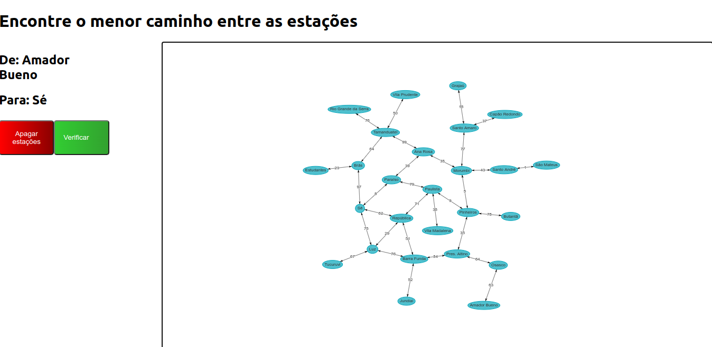
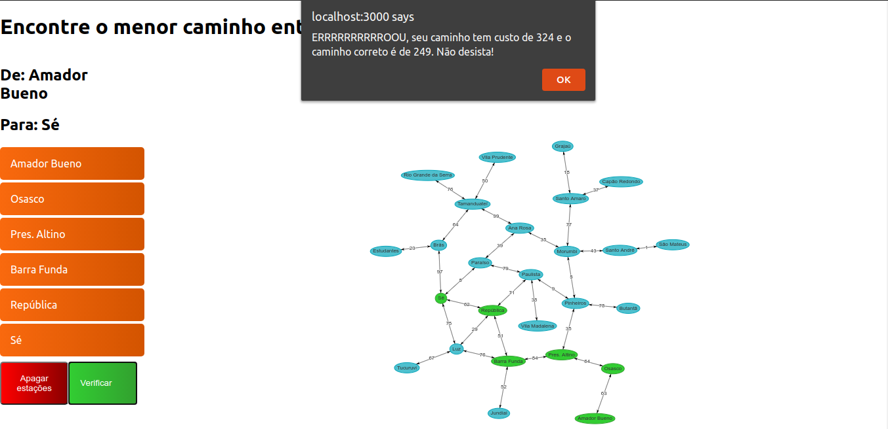
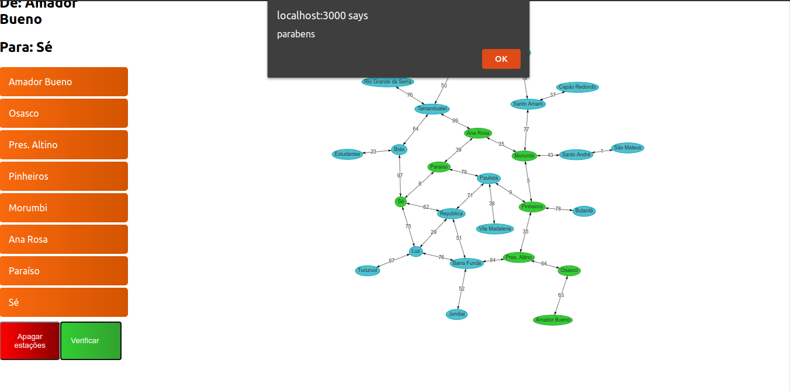

# Metrô

**Número da Lista**: 2<br>
**Conteúdo da Disciplina**: Grafos 2<br>

## Alunos
|Matrícula | Aluno |
| -- | -- |
| 17/0103471  |  Gabriel Marques Tiveron |
| 17/0115208  |  Victor Levi Peixoto |

## Sobre 
O projeto tem como objetivo testar a capacidade humana de percorer um grafo, o programa realiza a busca do menor caminho possível por meio do algorítmo de dijkstra, o mesmo está sempre certo e cabe ao usuário tentar escolher o melhor caminho.

O projeto se baseia na linha de metrô de São Paulo, algo que pode ser útil e pode trazer certas lembranças ao usuário.

## Screenshots




## Vídeo


## Instalação 
**Linguagem**: JavaScript<br>
**Framework**: ReactJs<br>
Ter o npm na versão 6.14.4

## Uso 
Para executar o projeto basta ter o [npm](https://www.npmjs.com/get-npm) e instalar as dependências por meio do comando ```npm install``` dentro da pasta frontend

